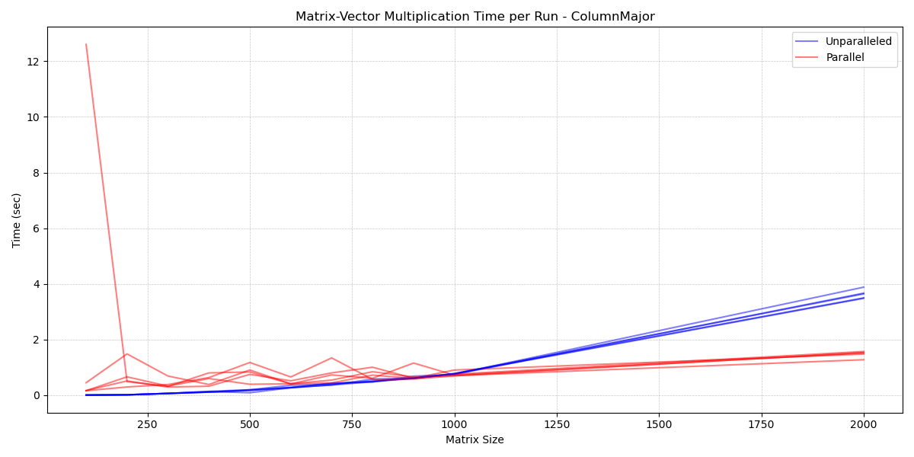

[](https://classroom.github.com/a/HlQKP7Zu)
# Challenge 2: A Sparse Matrix
<p align="center">
  <a href="https://img.shields.io/badge/C%2B%2B-20-blue"></a>
  <a href="https://img.shields.io/badge/GNU Make-3.27.6-blue"></a>
  <a href="https://img.shields.io/badge/clang-18.1.3-blue"></a>
</p>


# Project Structure and Description
```
challenge2-gasati/
├── src/
│   ├── main.cpp
├── include/
│   ├── Matrix.hpp
│   ├── Matrix.tpp
|   ├── StorageOrder.hpp
|   ├── Utils.hpp
├── assets
├── Makefile
├── run
├── LICENSE
└── README.md
```
### Parallelization
We implemented a matrix-vector multiplication method that automatically selects between parallel and sequential execution based on the number of rows in the matrix, specifically in the case of the CSR storage format. When the matrix is compressed and contains more rows than a predefined threshold (```NROWS_PARALLELIZATON_LIMIT```), the parallel version is employed to enhance performance on larger datasets. Otherwise, the sequential version is preferred, as it tends to be faster for smaller inputs due to reduced overhead.

To determine the optimal threshold, we conducted a series of benchmark experiments comparing both execution strategies on matrices of increasing size.


The results indicated an inversion point at approximately 1000 rows, beyond which parallel computation consistently outperformed the sequential approach. Consequently, we set ```NROWS_PARALLELIZATON_LIMIT = 1000``` in include\Parameters.hpp.

A similar analysis was performed for the CSC storage format, and the same threshold value (```1000```) was adopted.


# Setup (Linux / macOS)
### Prerequisites
Ensure you have the following dependencies installed on your environment:
- C++20-compatible compiler (e.g., GCC, Clang)
- GNU Make
- CMake
- zlib development libraries
- OpenMPI

📦 Install all prerequisites (Debian/Ubuntu)
```
sudo apt update && sudo apt install -y g++ clang cmake make zlib1g-dev libopenmpi-dev openmpi-bin
```
🍎 For macOS (via Homebrew)
```
brew install gcc clang cmake make zlib open-mpi
```

### Building the Project
Clone the repository:
``` 
git clone https://github.com/PACS-24-25/challenge2-gasati.git
cd challenge2-gasati
```
Build with the Makefile:
```
make
```
Run the program:
```
./main
```
