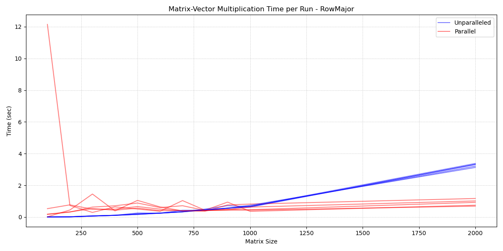

[](https://classroom.github.com/a/HlQKP7Zu)
# Challenge 2: A Sparse Matrix
<p align="center">
  <a href="https://it.wikipedia.org/wiki/C%2B%2B"></a>
  <a href="https://www.gnu.org/software/make/"></a>
  <a href="https://www.mingw-w64.org/"></a>
  <a href="https://www.open-mpi.org/"></a>
  <a href="https://zlib.net/"></a>
</p>


## 🗂️ Project Structure
```
challenge2-gasati/
├── src/
│   ├── main.cpp
├── include/
│   ├── Matrix.hpp
│   ├── Matrix.tpp
|   ├── StorageOrder.hpp
|   ├── Utils.hpp
|   ├── Utils.tpp
|   ├── Tests.hpp
|   ├── Tests.tpp
|   ├── Parameters.hpp
|   ├── CompressedMatrix.hpp
|   ├── NormType.hpp
├── assets
├── extras
|   ├── parallel_vs_unparallel_plot.py
├── output
├── Makefile
├── run
├── doxygen_config
├── LICENSE
└── README.md
```
## 🔎 Matrix Class Overview
The Matrix class is a template class designed to represent a sparse matrix with optional compression. 
It supports both uncompressed (COO format) and compressed (CSR/CSC format) representations, providing efficient storage and operations for sparse matrices. 
The class includes various matrix operations such as multiplication, resizing, updating, and compression/decompression, as well as methods for handling Matrix Market files.

### Key Template Parameters:
- ```T```: The type of the matrix elements (e.g., int, float).
- ```Order```: The storage order of the matrix, which can be RowMajor or ColumnMajor (defined as a struct in StorageOrder.hpp).
### Matrix Storage Formats
- **COO (Coordinate Format):**
  The uncompressed storage format where each non-zero element is explicitly stored as a triplet (row, column, value).
  In this project, the COO format is implemented using a ```std::map<std::array<size_t, 2>, T>``` called ```sparse_data_```, allowing for dynamic insertion and access of sparse entries.
- **CSR/CSC (Compressed Sparse Row/Column):**
  The compressed storage format that reduces memory usage by splitting the matrix into three arrays:
  - ```values```: the nonzero elements, stored consecutively;
  - ```inner_index```: the column indices (in CSR) or row indices (in CSC) corresponding to each value;
  - ```outer_ptr```: pointers marking the start of each row (CSR) or column (CSC) in the values array.
    
  In this project, CSR/CSC storage is encapsulated within a ```CompressedMatrix<T>``` struct named ```compressed_data_```.

### Principal Methods
#### Constructors

- ```Matrix(size_t rows, size_t cols)```: Initializes an empty matrix with the specified number of rows and columns (all values are set to 0).

- ```Matrix(const std::vector<std::vector<T>>& mat)```: Initializes the matrix from a 2D vector, updating the sparse data.

#### Core methods

- ```update(...)```: Updates the value at position (i, j). Inserts or updates a value if non-zero, or removes it if zero.

- ```resize(...)```: Resizes the matrix, removing elements outside the new bounds.

- ```compress()```: Compresses the matrix from COO to CSR/CSC format, freeing the uncompressed storage.

- ```decompress()```: Decompresses the matrix from CSR/CSC to COO format.

- ```product_by_vector(...)```: Multiplies the matrix by a vector (supports both compressed and uncompressed matrices).

- ```compressed_product_by_vector(...)```: Multiplies the compressed matrix by a vector.

- ```compressed_product_by_vector_parallel(...)```: Multiplies the compressed matrix by a vector in parallel using OpenMP.

- ```transpose()```: Transposes the matrix, swapping rows and columns, and recompresses it if necessary.

- ```diagonal_view()```: Extracts the diagonal elements of the matrix.

- ```norm()```: Computes a matrix norm (e.g., One, Infinity, or Frobenius) based on the chosen norm type.

- ```mm_load_mtx(...)```: Loads a Matrix Market file (.mtx or .mtx.gz) into the matrix's sparse data structure.

#### Information & Printing

- ```is_compressed()```: Checks if the matrix is currently compressed.

- ```weight()```: Returns the memory usage of the matrix in bytes.

- ```print(...)```: Prints the matrix contents with specified field width.

- ```info()```: Prints general information about the matrix (size, storage type, etc.).

- ```size()```: Returns the dimensions of the matrix.

### Adaptive Parallelization
We implemented a matrix-vector multiplication method that automatically selects between parallel and sequential execution based on the number of rows in the matrix, specifically in the case of the CSR storage format. When the matrix is compressed and contains more rows than a predefined threshold (```NROWS_PARALLELIZATON_LIMIT```), the parallel version is employed to enhance performance on larger datasets. Otherwise, the sequential version is preferred, as it tends to be faster for smaller inputs due to reduced overhead.

To determine the optimal threshold, we conducted a series of benchmark experiments comparing both execution strategies on matrices of increasing size.



The results indicated an inversion point at approximately 1000 rows, beyond which parallel computation consistently outperformed the sequential approach. Consequently, we set ```NROWS_PARALLELIZATON_LIMIT = 1000``` in include\Parameters.hpp.

A similar analysis was performed for the CSC storage format, and the same threshold value (```1000```) was adopted.
## 🔬 Testing
A comprehensive list of tests has be implemented in Tests.hpp/Tests.tpp and can be chosen from a menu in main.cpp.

The following are available:
1. **Matrix-Vector Multiplication Test 1**  
   Verifies the correctness of matrix-vector multiplication.

2. **Compressed Parallel vs Unparallel Speedtest**  
   Compares the execution times for parallel vs. non-parallel matrix-vector multiplication on compressed matrices and creates a .csv file with results in the output directory.

3. **Compressed vs Uncompressed Speedtest**  
   Compares the performance of matrix-vector multiplication between compressed and uncompressed matrices.

4. **Matrix Market Speedtest (lnsp_131.mtx.gz)**  
   Evaluates matrix-vector multiplication on a matrix loaded from a Matrix Market file.

5. **Complex Matrix Times Vector Test**  
   Performs matrix-vector multiplication on a complex-valued sparse matrix and vector.

6. **Matrix Norm Test (int, RowMajor)**  
   Calculates and verifies matrix norms for an integer matrix in RowMajor format.

7. **Matrix Resize Test**  
   Tests the resizing functionality of a matrix.

8. **Diagonal View Test**  
   Extracts and verifies the diagonal elements of a matrix.

9. **All (RowMajor/ColumnMajor, Compressed/Uncompressed) Multiplication Speedtest**  
   Compares the performance of matrix-vector multiplication across various storage formats and orders (RowMajor/ColumnMajor, Compressed/Uncompressed).

## ⚙️ Setup (Linux / macOS / Windows)
### Prerequisites
Ensure you have the following dependencies installed on your environment:
- C++20-compatible compiler (e.g., GCC, Clang)
- GNU Make
- CMake
- zlib development libraries
- OpenMPI

### Install all prerequisites
#### Linux (Debian/Ubuntu)
```
sudo apt update && sudo apt install -y g++ cmake make zlib1g-dev libopenmpi-dev openmpi-bin
```
#### macOS (via Homebrew)
```
brew install gcc cmake make zlib open-mpi
```
#### Windows (via pacman)
1. Install [MinGW-w64](https://www.mingw-w64.org/) or [MSYS2](https://www.msys2.org/).
2. Install the required packages (example for MSYS2):
   ```
    pacman -Syu
    pacman -S mingw-w64-x86_64-gcc mingw-w64-x86_64-cmake mingw-w64-x86_64-make mingw-w64-x86_64-zlib mingw-w64-x86_64-openmpi
    ```
3. Make sure to add ```gcc```, ```cmake```, and ```make``` to your system ```PATH``` if not done automatically.

### Building the Project
Clone the repository:
``` 
git clone https://github.com/PACS-24-25/challenge2-gasati.git
cd challenge2-gasati
```
Build with the Makefile:
```
make
```
Run the program:
```
./main
```
- ```./run``` was made to automate ```make clean```, ```make distclean```, ```make``` operations for quick debugging.

## 📚 Documentation
This project is documented using **Doxygen**.

Follow the instructions below to generate and view the documentation:
### Install Doxygen and Graphviz

#### Linux (Ubuntu/Debian)
```sudo apt-get install doxygen graphviz```
#### macOS (via Homebrew)
```brew install doxygen graphviz```
#### Windows
[Download Doxygen](https://www.doxygen.nl/download.html) and [Graphviz](https://graphviz.org/download/) from their respective websites.
Install both.
### Generate Documentation
1. Open CMD, navigate to ```challenge2-gasati``` folder.
2. Run ```doxygen doxygen_config```. 
3. Open the generated ```index.html``` in the ```challenge2-gasati/html``` directory to view the documentation.
