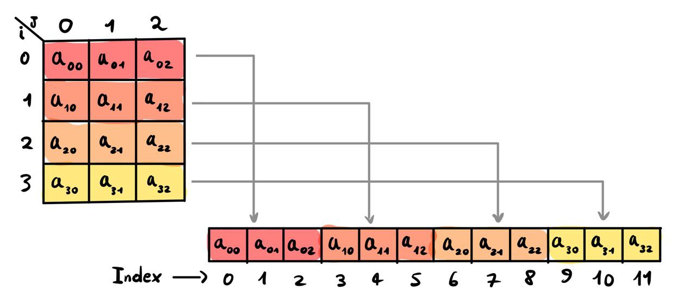

[](https://classroom.github.com/a/HlQKP7Zu)
# Challenge 2: A Sparse Matrix
<p align="center">
  <a href="https://img.shields.io/badge/C%2B%2B-20-blue"></a>
  <a href="https://img.shields.io/badge/GNU Make-3.27.6-blue"></a>
  <a href="https://img.shields.io/badge/clang-18.1.3-blue"></a>
</p>

### Matrix Storage Method
In our Matrix class implementation, the matrix is stored in a vector using one of the following methods:
- Row-major ordering
- Column-major ordering

In the row-major (or column-major) storage system, the matrix elements are stored in a one-dimensional vector by traversing the matrix row by row (or column by column, respectively).

With the Row-major ordering method, the mapping from two-dimensional indices $(i,j)$ to a one-dimensional index $k$ is given by the formula:
$$k=i\cdot M+j$$
where $M$ is the number of columns in the matrix.

Similarly, with the Column-major ordering method, the mapping from two-dimensional indices $(i,j)$ to a one-dimensional index $k$ is given by the formula:
$$k=j\cdot N+i$$
where $N$ is the number of rows in the matrix.


*Example of Row-major storage method. You can check that $k=i\cdot M+j$ holds true.*

In our implementation,
- N = ```type_t rows_``` (private attribute of the Matrix class)
- M = ```type_t cols_``` (private attribute of the Matrix class)
- vector = ```vector<T> data_``` (private attribute of the Matrix class)
- the conversion $(i,j)\to k$ is done by the private method ```Matrix::index(i,j) ```


## Project Structure and Implementation Choices
```
challenge2-gasati/
├── src/
│   ├── main.cpp
├── include/
│   ├── Matrix.hpp
│   ├── Matrix.tpp
|   ├── StorageOrder.hpp
├── Challenge24-25-2.pdf
├── Makefile
├── run
├── LICENSE
└── README.md
```
# Setup (Linux)
### Prerequisites
Ensure you have the following dependencies installed on your Linux environment:
- C++ Compiler (Clang, GCC, MSVC)
- Make

To install all the prerequisites, run the following command:
 ```
 sudo apt update && sudo apt install g++ cmake make
```
(the project was tested using C++ 20, GNU Make 3.27.6, clang 18.1.3)
### Building the Project
Clone the repository:
``` 
git clone https://github.com/PACS-24-25/challenge2-gasati.git
cd challenge2-gasati
```
Build with the Makefile:
```
make
```
Run the program:
```
./main
```
